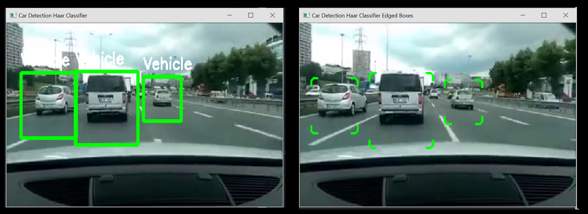

# Object-Car-Recognition-Tracking-With-Haar-Classification

Tracking Cars using Haar classification with OpenCV using a trained cascade classifier.

There are two examples included here, one with regular tracking using a generic square, the other is an edged square:

<h2>Installation: Setting Up Python 3.X with OpenCV and DLIB:</h2>

<strong>1. Download python 3 here, in this case it was python-3.6.4-amd64 for windows:</strong>
https://www.python.org/downloads/release/python-364/

<strong> 2. To install python libraries on windows: </strong>
<ul>
 	<li> Open up installation directory and run cmd on windows. 	</li>
 	<li> cd D:\Python3\Scripts 	</li>
 	<li> cmd on toolbar 	</li>
 	<li> pip install [LibraryName] 	</li>
</ul>

<strong> 3. Install the following libraries: </strong>
<ul>
 	<li> OpenCV (pip3 install opencv-python) 	</li>
</ul>

# Classifier Data Source

Haar-Feature Like Car Detection Classifiers cars1.xml:
<ul>
 	<li> Created by github user 199995 	</li>
 	<li> Source: https://gist.github.com/199995/37e1e0af2bf8965e8058a9dfa3285bc6 	</li>
</ul>

Haar-Feature Like Car Detection Classifiers cars3.xml:
<ul>
 	<li> Created by github user pmbaumgartner 	</li>
 	<li> Source: https://gist.github.com/pmbaumgartner/98756c3ae310d8f127a5d9b386e7ea00 	</li>
</ul>

